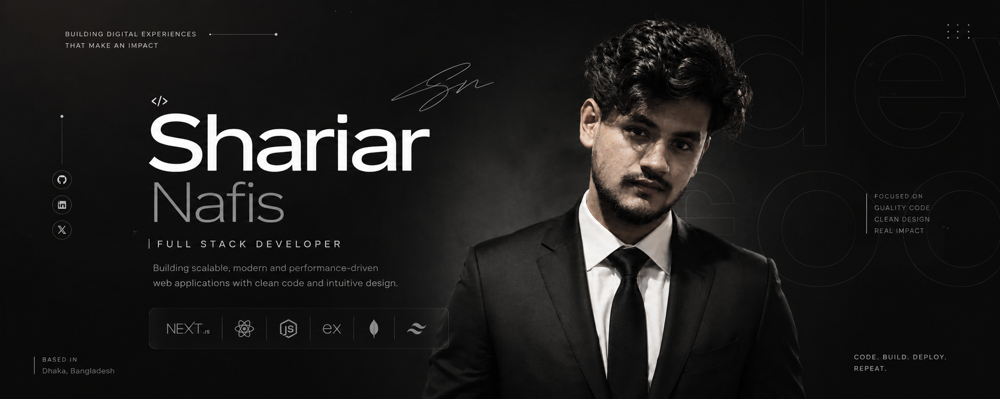

# Shariar Nafis

### Full Stack Developer

Building scalable, modern web applications with clean architecture, thoughtful user experiences, and maintainable code.

  
  
  
  

---

# About Me

I'm a **Full Stack Developer** based in **Dhaka, Bangladesh**, focused on building modern, responsive, and scalable web applications.

I enjoy turning ideas into polished digital products by combining clean frontend development with reliable backend architecture. My approach emphasizes simplicity, performance, maintainability, and a great user experience.

Whether I'm developing a SaaS platform, creating an admin dashboard, or building a complete web application, I strive to write code that's clean, reusable, and easy to maintain.

---

# Currently

<table>
<tr>
<td>

🌱 **Learning**

Advanced Backend Architecture & System Design

</td>
<td>

🚀 **Building**

Modern Full Stack Web Applications with Next.js

</td>
</tr>

<tr>
<td>

💡 **Exploring**

Performance Optimization, Authentication & Scalable UI

</td>
<td>

🎯 **Goal**

Build production-ready applications and continuously improve as a software engineer.

</td>
</tr>

<tr>
<td>

🤝 **Open To**

Collaboration on meaningful open-source and full stack projects.

</td>
<td>

📫 **Reach Me**

**your@email.com**

</td>
</tr>
</table>

---

# Tech Stack

---

# Featured Projects

## LegalEase

Modern lawyer hiring platform connecting clients with legal professionals through a clean and scalable user experience.

**Tech Stack**

`Next.js` • `Node.js` • `Express.js` • `MongoDB` • `Tailwind CSS`

**Repository**

`🔗 https://github.com/shariarnafis45/Legal-Ease`

**Live Demo**

`🌐 Coming Soon`

---

## HireLoop

A modern hiring platform designed to simplify recruitment workflows for employers and job seekers.

**Tech Stack**

`Next.js` • `Express.js` • `MongoDB`

**Repository**

`🔗 Coming Soon`

**Live Demo**

`🌐 Coming Soon`

---

## IdeaVault

A platform for discovering, organizing, and sharing startup ideas with a clean developer-focused experience.

**Tech Stack**

`Next.js` • `React` • `MongoDB`

**Repository**

`🔗 Coming Soon`

**Live Demo**

`🌐 Coming Soon`

---

## QurbaniHat

Online livestock marketplace with booking functionality and a streamlined purchasing experience.

**Tech Stack**

`Next.js` • `Express.js` • `MongoDB`

**Repository**

`🔗 Coming Soon`

**Live Demo**

`🌐 Coming Soon`

---

# GitHub Analytics

---

# GitHub Streak

---

# Contribution Graph

---

# Contribution Calendar

---

# Connect

<a href="https://github.com/yourusername">
GitHub
</a>
&nbsp;&nbsp;•&nbsp;&nbsp;
<a href="https://linkedin.com/in/yourusername">
LinkedIn
</a>
&nbsp;&nbsp;•&nbsp;&nbsp;
<a href="https://yourportfolio.com">
Portfolio
</a>
&nbsp;&nbsp;•&nbsp;&nbsp;
<a href="mailto:your@email.com">
Email
</a>
&nbsp;&nbsp;•&nbsp;&nbsp;
<a href="https://facebook.com/yourusername">
Facebook
</a>

---

*"Code with clarity. Build with purpose."*

